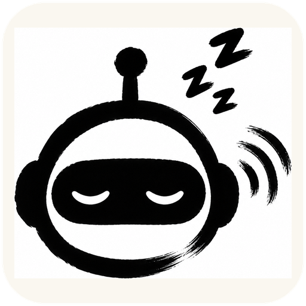
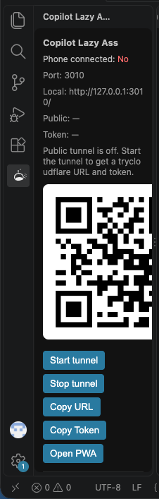

<p align="center">
  
</p>

<h1 align="center">Copilot Lazy Ass Companion</h1>

<p align="center"><a href="README.zh-CN.md">中文版 README → README.zh-CN.md</a></p>

A VS Code extension that mirrors your desktop **GitHub Copilot Chat** to your phone (or any browser) in real time — read answers, send prompts, approve tool calls, switch sessions and models, all without being at your desk.

> Non-invasive companion: it does not modify or replace `GitHub.copilot-chat`. It only reads the session files Copilot writes to disk and runs a local bridge.

## What it does

- **Live mirror** — assistant answers stream to your phone as Copilot generates them: markdown, thinking steps, tool-call cards
- **Send from phone** — prompts land in the real Copilot Chat composer and run exactly like you typed them
- **Approve tool calls** — Copilot's permission cards (terminal commands, file writes) can be confirmed remotely
- **Queue & stop** — fire messages while a turn is running; they queue FIFO and auto-send. Double-tap Stop aborts the in-flight turn
- **Session drawer** — every chat session grouped by workspace, titled, searchable, full-history replay
- **Model switcher** — change the active model from the phone
- **Terminal panel** — run shell commands remotely via Shell Integration (clipboard read-back fallback)
- **Push notifications** — get pinged when Copilot finishes a turn (locally generated VAPID keys)
- **Multi-window discovery** — multiple VS Code windows each run a bridge; the PWA auto-discovers them

## Works without a public IP

**A temporary public tunnel is built in.** One command (**Start Tunnel**) spins up a Cloudflare quick tunnel (`*.trycloudflare.com`) so the PWA is reachable from anywhere — cellular, another network, anywhere. No public IP, port forwarding, or server of your own needed. A one-time session token is auto-minted into the QR/URL for every tunnel session. It's off by default — stop it when you're done.

## How it works

```
Copilot Chat ──(writes)──> chatSessions/*.jsonl + transcripts + session-store.db
                                  │
                     extension tails the three async sources
                                  │
                TurnArbiter (dedup / order / turn attribution)
                                  │
                 local bridge :3010  (HTTP + WebSocket)
                  ┌───────────────┴───────────────┐
               LAN / tunnel                    PWA
              (your phone or any browser)
```

Copilot has no event API, so the extension tails the three async sources it writes, arbitrates them into one ordered event stream, and relays it to a PWA. Phone-originated messages are injected back via workbench chat commands. **Everything is local — no third-party server ever sees your data.**

## Screenshot

Extension sidebar panel — phone pairing QR, tunnel controls:



## Install

1. Download `copilot-sidecar-companion-*.vsix` from [Releases](https://github.com/cmulittlechild/Copilot-Lazy-Ass-Companion/releases/latest)
2. VS Code → `Cmd/Ctrl+Shift+P` → **Extensions: Install from VSIX…** (or `code --install-extension copilot-sidecar-companion-1.0.0.vsix`)
3. **Developer: Reload Window** — status bar shows `Sidecar :3010`, sidebar gains the **Copilot Lazy Ass → QR / 连接** panel

**Requirements**: VS Code 1.93+ (1.99+ recommended — its Node ≥22.5 enables the faster SQLite session index; older versions degrade gracefully), **GitHub Copilot Chat** installed & signed in. Verified on macOS and Windows.

## Quick start

1. The bridge auto-starts (`Sidecar :3010` in the status bar)
2. Run **Copilot Lazy Ass: Show QR Panel** (or open the sidebar QR / 连接 panel)
3. Scan the QR with your phone (same Wi-Fi) — the PWA opens; "Add to Home Screen" for an app feel
4. Chat from the phone — send, queue, stop, switch sessions/models, approve tool cards, all in-page

**Phone can't connect?** Set `copilotSidecar.host` to `0.0.0.0`, confirm same LAN + firewall. **Away from home?** Run **Copilot Lazy Ass: Start Tunnel** — no public IP needed; the QR gets a tokened public URL automatically.

## Languages

The extension UI, QR panel, notifications and the phone PWA ship in **English and
Simplified Chinese** — VS Code display language decides the
extension side (`en`/`zh-cn` bundled), and the PWA follows the browser language.
A `中/EN` toggle in the PWA session drawer switches it manually (stored in
localStorage).

## Commands

| Command | Action |
|---------|--------|
| `Copilot Lazy Ass: Start Bridge` / `Stop Bridge` | start/stop the local bridge |
| `Copilot Lazy Ass: Show QR Panel` | open the QR pairing panel |
| `Copilot Lazy Ass: Show Status` | diagnostics (port / session index / logs) |
| `Copilot Lazy Ass: Copy PWA URL` / `Copy Auth Token` | copy connect URL / token |
| `Copilot Lazy Ass: Start Tunnel` / `Stop Tunnel` / `Restart Tunnel` | public tunnel on/off |

## Settings (`copilotSidecar.*`)

| Key | Default | Note |
|-----|---------|------|
| `port` | `3010` | bridge port (+20 auto-scan if busy) |
| `host` | `127.0.0.1` | `0.0.0.0` for LAN access |
| `autoStart` | `true` | start bridge on VS Code launch |
| `authToken` | `""` | shared token — **required for LAN/tunnel** |
| `defaultMode` | `agent` | chat mode for phone messages |
| `injectSessionOpen` | `editor` | how the target session opens for injection |
| `pollMs` | `50` | JSONL tail poll interval |
| `sessionRescanMs` | `2000` | newest-session rescan period |
| `liveOnly` | `true` | `false` = replay full history on connect |
| `preferTranscript` | `true` | use realtime transcripts as primary source |
| `enableTunnel` | `false` | auto-start tunnel when bridge starts |
| `downloadCloudflared` | `true` | cache cloudflared under `~/.copilot-sidecar-companion/` |
| `tunnelTimeoutMs` | `35000` | wait for trycloudflare URL |

## Security & privacy

- Default binds `127.0.0.1` — nothing leaves the machine. `0.0.0.0` or a tunnel exposes it to LAN/public — **always set `authToken`** (tunnels auto-mint a one-time token per session into the QR, never written to settings)
- Phone-side terminal execution uses your local privileges — treat the token like a password
- No telemetry, no third-party servers; session content flows only between your machine and your browser. Tunnel mode's TLS covers phone→Cloudflare edge only

## Troubleshooting

- **Phone can't connect** → `host=0.0.0.0`, same Wi-Fi, firewall allows the port
- **PWA looks stale** → hard-refresh (`Cmd/Ctrl+Shift+R`); version stamps auto-update
- **Injection hits wrong session** → `injectSessionOpen: "editor"` + **Show Status**
- **Remote workspace lags** → remote workspaces have no transcripts dir; chatSessions fallback (~60s lag)
- **Logs** → **Show Status** + VS Code developer console

## Development

```bash
npm install && npm run compile && npm run package   # produces the vsix
```

## Disclaimer / License

Unofficial community tool — **not affiliated with GitHub or Microsoft**. It reads Copilot Chat's local session files on your own machine; use within the GitHub Copilot ToS and your org's policies. [MIT](LICENSE).
