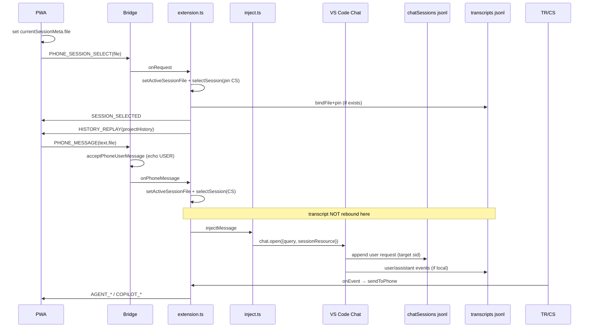

# Full Chain Audit — phone select → inject → mirror

**Scope:** `projects/companion-open` source **@0.5.10**  
**Also verified:** installed VSIX  
`~/.vscode/extensions/local-dev.copilot-sidecar-companion-0.5.10`  
**Date:** 2026-08-07  
**Method:** static end-to-end source walk + live workspaceStorage jsonl + ports

---

## TL;DR

| 结论 | 说明 |
|------|------|
| **设计链路（0.5.10）** | 选会话 → `activeSessionFile` → `PHONE_MESSAGE.file` 再绑定 → `chat.open({query, sessionResource})` → 定向会话；镜像 pin + foreign 扫描 gated |
| **工业级完备性** | **未达标** — 核心 inject 定向已修，但仍有 race / 多 bridge / 镜像 rebind 缺口 |
| **真实 jsonl 证据** | 手机 `hi` **落在错误会话**（见 §7）；该样本发生在 **0.5.10 安装之前**（0.5.9 时代回归） |
| **0.5.9 历史顺序修复** | **仍在** `projectHistory` 按 request 交错 + `replaySession` 按 turn 裁剪 |

**总体：** 链路 **6/10 步 PASS（代码层）**；**1 步历史 FAIL（实测）**；**3 项 residual 风险仍为 FAIL/PARTIAL**。

---

## 0. 审计对象与版本

| 项 | 值 |
|----|----|
| package | `copilot-sidecar-companion@0.5.10` |
| `extensionKind` | `["ui"]`（本机 UI 宿主，非 remote） |
| bridge 默认 | `127.0.0.1:3010`，`portRange: 20` |
| 本机监听 | **3010 / 3011 / 3012 三 bridge 并存**（三 Code Helper 进程） |
| VSIX mtime | 0.5.9 `2026-08-06 23:38`；0.5.10 `2026-08-07 00:02` |

---

## 1. 链路逐步判定

### Step 1 — PWA 点会话：写 `currentSessionMeta.file` + 发 `PHONE_SESSION_SELECT`

**判定: PASS**

证据 `media/pwa/app.js`：

```js
// setSessionTitle(title, file) → currentSessionMeta.file = file
item.addEventListener('click', () => {
  setSessionTitle(lab, s.file);          // 先本地写 file
  send({ type: 'PHONE_SESSION_SELECT', file: s.file });
  closeDrawer();
});
```

- 点击时 **同步** 更新 `currentSessionMeta.file`（不依赖 `SESSION_SELECTED` 回包）。
- `SESSION_SELECTED` 成功路径再 `setSessionTitle` 一次（幂等）。

**缺口（不降本步为 FAIL）：** 无「选中中」锁；用户可在 `HISTORY_REPLAY` 到达前就 `doSend`（见 Race）。

---

### Step 2 — extension：`setActiveSessionFile` + `selectSession` + `HISTORY_REPLAY`

**判定: PASS**

证据 `src/extension.ts` `PHONE_SESSION_SELECT`：

1. `watcher.selectSession(file)` → `pinnedFile` + `bindFile(..., skipBootstrap)`（live@EOF）
2. `ok && file` → `setActiveSessionFile(file)`
3. `transcriptWatcher.bindFile(tfile, { replay: false })` + `pinFile(tfile)`  
   （`tfile` 经 `workspaceIndex.resolveBySessionFile` 跨工作区反查）
4. `reply(SESSION_SELECTED)`
5. `projectHistory(file, 20)` → `bridge.replaySession(hist + SYSTEM, file)`

**工业点：**

| 点 | 状态 |
|----|------|
| pin 防 mtime 抢回 | PASS（SessionWatcher + TranscriptWatcher） |
| 历史单通道（无 bootstrap 双灌） | PASS |
| 跨工作区 transcript 目录 | PASS（有则 bind；无则 `transcriptActive=false` 降级 chatSessions） |
| `selectSession` 同文件再选仍 rebind | PASS（0.5.2+，测试 `test_sessionselect.mjs`） |

---

### Step 3 — PWA `doSend` 带 `file: currentSessionMeta.file`

**判定: PASS**

```js
send({ type: 'PHONE_MESSAGE', text, mode, file: currentSessionMeta.file || undefined })
```

- 乐观 `addUser` 在 send 前；`file` 取自 meta（Step1 已写）。
- `file` 为空时 extension **不会** rebind（仅依赖既有 `activeSessionFile` / focused fallback）。

---

### Step 4 — extension 注入前 re-bind `file`

**判定: PARTIAL（inject 侧 PASS，mirror 侧 FAIL）**

`PHONE_MESSAGE` 处理（`extension.ts`）：

```ts
if (typeof msg.file === "string" && msg.file.trim()) {
  setActiveSessionFile(msg.file.trim());
  try { watcher?.selectSession(msg.file.trim()); } catch { /* best-effort */ }
}
bridge?.broadcast({ type: "COPILOT_TYPING" });
const result = await injectMessage(msg.text, mode);
// qrPanel: inject via=... sid=...
```

| 子项 | 判定 |
|------|------|
| `setActiveSessionFile` | PASS |
| `watcher.selectSession`（chatSessions pin/tail） | PASS |
| **`transcriptWatcher` 同步 rebind/pin** | **FAIL** — 仅 `PHONE_SESSION_SELECT` 会 bind transcript；`PHONE_MESSAGE` **不**碰 transcript |
| 注入路径 QR 日志 | PASS |

**后果：** 若仅靠 `file` 纠正（跳过 SELECT、或 SELECT 与 SEND 乱序、或 meta.file 指向非当前 pin 的会话），**chatSessions pin 会跟上，transcript 主实时源可能仍钉在旧会话** → 回复镜像可能串会话或依赖 chatSessions 慢路径/兜底。

---

### Step 5 — `injectMessage`：`sessionIdFromFile` + `localChatSessionUri` + `chat.open(sessionResource)`

**判定: PASS（相对 0.5.7–0.5.9 回归）**

`src/inject.ts` 0.5.10 优先级：

1. `sid = sessionIdFromFile(activeSessionFile)`
2. best-effort `activateSessionForInject(sid)`（仅 sidebar 路径，**禁止** `vscode.open` / editor 双面板）
3. **Path A：** `workbench.action.chat.open({ query, isPartialQuery:false, sessionResource })`（+ sidebar/view 变体）
4. **Path B：** 无 sid 或定向全失败 → `chat.open({query})` focused（`injectPath: focused-fallback-after-target-fail | focused-only`）
5. clipboard + 提示

URI 形：`vscode-chat-session://local/<base64url(sessionId)>`（对齐 LocalChatSessionUri）。

**残留：**

- Path B 仍可能静默打到 focused 错误会话（仅 QR 日志可见）。
- **无**「注入后校验目标 jsonl 是否出现该 USER」的闭环。
- `sessionResource` 在 **本窗口 workbench** 解析；跨窗口会话文件路径正确也不保证本窗口 chat 模型有该 session（多窗口见 §8）。

---

### Step 6 — 注入后「该会话」transcript/chatSessions 收到消息（非其他）

**判定: FAIL（历史实测） / 代码层 CONDITIONAL PASS（0.5.10 后待复测）**

#### 6.1 真实 jsonl（workspaceStorage）

工作区 hash：`6ea7fd91d95d0ee7b8771238283ff09b`  
（sidecar_remote / 本审计会话）

| 会话文件 | 官方标题 (`chat.ChatSessionStore.index`) | 用户文本 | 时间 |
|----------|------------------------------------------|----------|------|
| `8304329e-b101-4948-8099-5892a7f9fe93.jsonl` | **测试 DeepSeek V4 Flash** | `hello` | 2026-08-06 **23:52:58** |
| `42c7881d-500f-4b23-a39e-f01d9441bd90.jsonl` | **项目学习与理解** | **`hi`** | 2026-08-06 **23:55:50** |

- DeepSeek jsonl **无** `hi`（尾部最后用户句为 `hello`）。
- `hi` 明确写入 **项目学习与理解**（当前 focused / 大会话），`modelId` 样例为 `oaicopilot/grok-4.5-high`。
- 与 bug 描述一致：桌面在 DeepSeek 发 hello 手机可见；手机发 hi → 落到项目学习。

#### 6.2 时间线 vs 0.5.10

| 事件 | 时间 |
|------|------|
| 0.5.9 VSIX | 2026-08-06 23:38 |
| `hello` / `hi` 错会话 | 2026-08-06 23:52–23:55 |
| 0.5.10 VSIX | 2026-08-07 **00:02** |

→ 该 `hi` 是 **0.5.9（focused-only inject）时代** 的落点证据，**不能**单独证明 0.5.10 仍坏；但能证明回归真实存在且根因分析正确。

#### 6.3 0.5.10 后

需一次人工：手机选 DeepSeek → 发唯一 token → 确认仅 `8304329e…jsonl` 增 request。本审计未在 0.5.10 安装后复现新样本。

---

### Step 7 — 手机看到同会话回复；`scanForeignUserMessages` 不串会话

**判定: PASS（foreign 门控） / PARTIAL（回复路径）**

#### 7.1 `scanForeignUserMessages`（`sessionWatcher.ts`）

- 扫全部 chatSessions 增量，只投 **USER_MESSAGE**。
- **跳过** `this.current`（已 pin 会话由主 tail）。
- **关键门控：** `if (this.pinnedFile) continue;`  
  → pin 期间 **不**把其他会话桌面消息灌进当前 feed。  
  → **PASS：无 cross-pollution 到当前 feed。**
- 未 pin（跟随最新）时才 `foreign: true` 广播。

#### 7.2 同会话回复镜像

- 正常路径：SELECT 后 transcript pin + chatSessions pin 同 base → assistant 经 `sendToPhone`。
- `isInjectedEcho` / bridge `isPhoneEcho` 抑制手机 USER 回声。
- **PARTIAL：**  
  - `PHONE_MESSAGE` 不 rebind transcript（Step4）。  
  - `transcriptActive && ev.type !== "USER_MESSAGE"` 抑制 chatSessions 的 assistant；若 transcript 绑错文件，assistant 可能丢或来自错误文件直到 SELECT 纠正。  
  - bridge `history` **全局单槽**（无 per-session）；切会话靠 `replaySession` 清空——正确，但 live 广播 **无 sessionId 字段**，多手机/多 feed 无法按会话过滤（当前单 feed 可接受）。

---

## 2. 专项检查

### 2.1 Race：`SESSION_SELECTED` 返回前就发送

**判定: PARTIAL / 风险残留**

| 机制 | 效果 |
|------|------|
| 点击时已写 `currentSessionMeta.file` | SEND 可带正确 `file`，**不依赖** SELECT 回包 |
| extension 对 `msg.file` setActive + selectSession | inject 前可纠正 active |
| **无** await SELECT / 无 send 队列 | 与 in-flight SELECT 并发 |
| **无** PHONE_MESSAGE→transcript rebind | 镜像源可能仍旧会话 |
| bridge `ws.on('message')` **串行 await** handler | 同连接上 SELECT 与 MESSAGE 不会真正并行执行；**先到先完整跑完** |
| 若 MESSAGE 先于 SELECT 入队 | MESSAGE 用 `file` inject + pin chatSessions；随后 SELECT 再 projectHistory/replay → **可能用 REPLAY 冲掉刚发出的乐观气泡时序**（PWA clearFeed on HISTORY_REPLAY） |

**最坏 UI：** 用户秒发 → 先乐观气泡 → 稍后 HISTORY_REPLAY **清空 feed** 只放历史（可能尚不含刚注入的 turn）→ 短暂「消息消失」直到 live 增量。

**工业建议：** SELECT 期间 disable send 或队列 PHONE_MESSAGE 至 SELECT 完成；MESSAGE 路径补 transcript rebind。

---

### 2.2 多 bridge（3010–3012）：错误窗口吃到 `PHONE_MESSAGE`

**判定: FAIL（架构级 residual）**

本机实测：

```
Code Helper  PID  856  → 127.0.0.1:3010
Code Helper  PID  862  → 127.0.0.1:3011
Code Helper  PID 93031 → 127.0.0.1:3012
```

| 事实 | 含义 |
|------|------|
| `extensionKind: ["ui"]` | **每个 VS Code 窗口** 各自 activate UI 扩展宿主 |
| 模块级 `let bridge` / `activeSessionFile` | **每进程一份**，非跨窗口共享 |
| 端口 `EADDRINUSE` → +1 | 多窗口 = 多 bridge（0.5.1 已修崩溃） |
| 手机连的是 **URL 里的那一个 port** | 消息只进该进程的 `injectMessage` / 该窗口 workbench |
| `sessionResource` 作用域 | **仅该窗口** chat 服务；路径指向的 jsonl 可能属「别的窗口打开的工作区」 |
| Instance 抽屉 | 发现+提示换 port，**无**自动把 PHONE_MESSAGE 路由到正确 instance |

**错窗场景：**

1. 手机仍连 3010（窗 A），用户在窗 B 看 DeepSeek。  
2. 或扫了 3010 QR 但会话列表来自全局 `workspaceStorage` 扫描，选中的 file 属于窗 B 工作区。  
3. 窗 A `chat.open(sessionResource)` 可能创建错会话 / 新建 / focused-fallback**，jsonl 落点不可控。

**工业建议：** PHONE_MESSAGE 校验 `file` 的 workspace hash ⊆ 本窗 storage；不匹配则 SYSTEM 提示切 instance，拒绝 inject；或做跨进程 proxy（当前明确不做）。

---

### 2.3 `activeSessionFile` 单例与 multi-window

**判定: PASS（进程隔离） / 文档风险**

```ts
// inject.ts 模块级
let activeSessionFile: string | undefined;
```

- **不是** 机器级全局单例；是 **每个 extension host 模块闭包**。
- 多窗口 = 多 Node 进程 = 多份 `activeSessionFile` / `watcher` / `bridge`。  
- **同窗口内** 只有一个 companion activate（`if (bridge) return`）→ 单窗内单例正确。
- 风险在「手机连错进程」，不在「单进程内多写者」。

---

### 2.4 0.5.9 `projectHistory` / 轮次顺序是否仍在

**判定: PASS（完整保留）**

**`sessionWatcher.projectHistory`：**

- 按 request 轮次：USER → 该轮 response mutations → embedded response → `finalizeAllStreams` → pending DONE  
- 大文件 `readTailLines` 多档窗口（4/16/48MB）  
- 注释明确 0.5.9 根因（旧实现先全 USER 再全 AGENT）

**`bridge.replaySession`：**

- 过滤 HISTORY_SKIP / internal  
- 以 `USER_MESSAGE` 为 turn 边界，`MAX_TURNS = 40`  
- 再守 `HISTORY_MAX`，从尾部对齐到 USER，避免半截轮次  
- 安装包 dist 中 `turnStarts` / `MAX_TURNS` / `reqIndex` 均在

**未回退。**

---

## 3. 数据流图（0.5.10 意图）



---

## 4. 逐步记分卡

| # | 步骤 | 判定 |
|---|------|------|
| 1 | PWA 选会话写 meta + `PHONE_SESSION_SELECT` | **PASS** |
| 2 | extension setActive + select + HISTORY_REPLAY | **PASS** |
| 3 | doSend 带 `file` | **PASS** |
| 4 | MESSAGE 前 re-bind | **PARTIAL**（CS PASS / TR FAIL） |
| 5 | inject `sessionResource` 定向 | **PASS**（代码） |
| 6 | 目标会话 jsonl 收到消息 | **FAIL**（0.5.9 实测 hi）；0.5.10 **待复测** |
| 7 | 同会话回复 + foreign 不串 feed | **PASS/PARTIAL** |
| R1 | SELECT 前发送 race | **PARTIAL** |
| R2 | 多 bridge 错窗 | **FAIL** residual |
| R3 | activeSessionFile 进程模型 | **PASS**（需理解 ui 多实例） |
| R4 | 0.5.9 历史顺序 | **PASS** |

---

## 5. Residual bugs（按优先级）

### P0 — 多窗口 / 多 bridge 无会话归属校验

- 手机可对「列表里任意 jsonl」发往 **当前连接的** 窗口 inject。  
- 三端口并存时，错连 = 错 workbench = 错落点或 focused-fallback。  
- **缓解现状：** 实例抽屉手动切 port；`msg.file` 只能修 **本进程** active。

### P1 — `PHONE_MESSAGE` 不 rebind `transcriptWatcher`

- SELECT 与 SEND 的 mirror 绑定不对称。  
- 仅 `file` 纠正或乱序 SEND 时，assistant 实时源可能错/空。  
- **修复建议：** MESSAGE 路径复用 SELECT 的 `resolveBySessionFile` + `bindFile({replay:false})` + `pinFile`（仍禁止 replay）。

### P1 — focused-fallback 静默

- 定向命令全失败时仍 `chat.open({query})`，易再次出现「hi 进项目学习」。  
- **建议：** fallback 改硬失败 + SYSTEM_MESSAGE；或强制用户桌面打开目标会话；QR 已有 via 日志需产品化到手机。

### P2 — SELECT/SEND 与 HISTORY_REPLAY 冲刷

- 无 send gate；REPLAY `clearFeed` 可抹乐观气泡。  
- **建议：** `replaying` 期间队列出站 MESSAGE，或 REPLAY 后合并未 ack 的 local optimistic。

### P2 — bridge history 无 session 维度

- 单 history；靠 replay 切换。多客户端同 bridge 不同会话不支持（当前产品单 feed OK）。

### P3 — 无注入后 jsonl 闭环校验

- 工业级应：inject 后 N 秒内 tail 目标 file 是否出现 text；否则告警。

---

## 6. 与 0.5.7–0.5.10 因果对齐

| 版本 | inject 主路径 | 后果 |
|------|---------------|------|
| ≤0.5.6 | 曾尝试 session 切换 | 双面板等问题 |
| 0.5.7–0.5.9 | **`chat.open({query})` 不带 sessionResource** | 打 focused → **hi→项目学习** |
| 0.5.10 | **有 active → 强制 sessionResource**；PWA `file`；MESSAGE rebind CS | 定向修复；TR rebind 仍缺 |

---

## 7. 复测清单（0.5.10 安装后必做）

1. 确认手机 PWA 连的 port = 打开 DeepSeek 的那一窗（QR/实例抽屉）。  
2. 选 **测试 DeepSeek V4 Flash** → 等 HISTORY_REPLAY 结束。  
3. 发唯一串如 `audit-hi-0.5.10-<ts>`。  
4. 断言：  
   - 仅 `8304329e….jsonl` 新增该 USER；  
   - `42c7881d….jsonl` **无**该串；  
   - QR 日志 `inject via=chat.open+sessionResource sid=8304329e…`；  
   - 手机 feed 收到同会话 assistant，无其它会话 USER 插入。  
5. 负面：选 DeepSeek 后 **立即** 连发（不等 REPLAY）— 记录是否 clearFeed 丢气泡。  
6. 负面：手机连 3010、DeepSeek 在 3011 窗 — 记录落点。

---

## 8. 源码锚点（便于跳转）

| 区域 | 文件 |
|------|------|
| 选会话 / 注入入口 | `src/extension.ts` (`PHONE_SESSION_SELECT`, `PHONE_MESSAGE`) |
| 定向 inject | `src/inject.ts` (`setActiveSessionFile`, `injectMessage`, `localChatSessionUri`) |
| 历史投影 | `src/sessionWatcher.ts` (`projectHistory`, `selectSession`, `scanForeignUserMessages`) |
| 回放裁剪 | `src/bridge.ts` (`replaySession`, turnStarts/MAX_TURNS) |
| transcript pin | `src/transcriptWatcher.ts` (`bindFile`, `pinFile`) |
| PWA | `media/pwa/app.js` (`setSessionTitle`, session click, `doSend`) |
| 实例发现 | `src/instances.ts` + PWA instance drawer |

---

## 9. 最终结论

- **手机选会话 → 扩展 pin + 单通道历史回放：** 工业可用（PASS）。  
- **手机发送携带 file + sessionResource 定向：** 0.5.10 **代码层 PASS**，修复了 0.5.7–0.5.9 根因。  
- **端到端「永不落错会话」工业保证：未达成**，因：  
  1. 多 UI 宿主 / 多 port 无强制亲和；  
  2. MESSAGE 路径 transcript 不对称；  
  3. focused-fallback 仍可能静默；  
  4. 历史 jsonl 已证明错落真实发生（0.5.9 窗口）。  
- **0.5.9 历史顺序 / turn 裁剪：完整保留（PASS）。**  
- **`scanForeignUserMessages` 在 pin 下不污染当前 feed（PASS）。**

**签署建议：** 标记为 **CONDITIONAL PASS on inject path** + **OPEN residuals P0/P1**；合并生产前至少完成 §7 复测 1–4，并优先补 P1 transcript rebind 与错窗拒绝。
)
